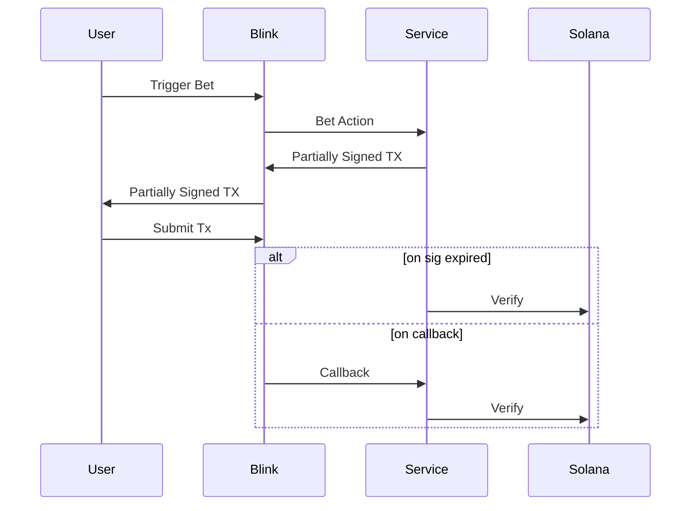
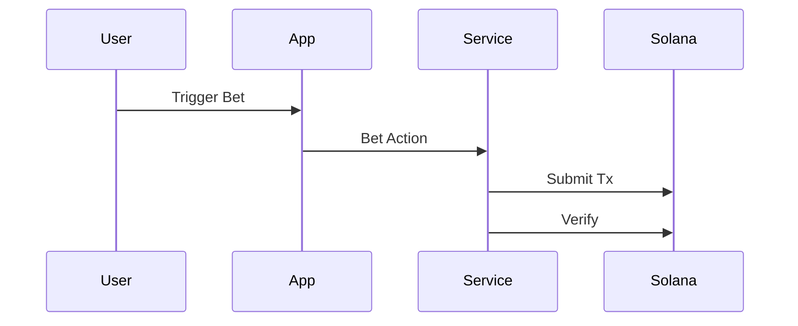

# Bet flow

This document explains how a bet is created via blink and app.

## Blink

In the flow of Blink, the transaction MUST be made by the user. Therefore, we check if the bet is confirmed when:

1. The Solana Action sends a callback request
2. The service signature is expired (i.e. 151 blocks after signed). If user hasn't made the tx, the tx is impossible to be finished then, or we suppose to see the tx is confirmed on chain.

The bet can be confirmed by checking if the `BetAccount` associated to the `bet.id` was created via `web3.findProgramAddressSync` and `program.account.BetAccount.fetch`.

## App

In the flow of App, the transaction will be made by the service, therefore, the flow is very simple.

